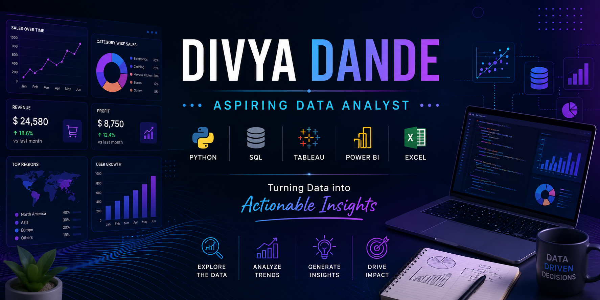

  

<h1 align="center">Hi 👋, I'm Divya Dande</h1>

<h3 align="center">
Aspiring Data Analyst | Python | SQL | Tableau | Power BI | Excel
</h3>

  Turning raw data into meaningful insights 📊

---

## 👩‍💻 About Me

- 🎯 Aspiring Data Analyst passionate about solving real-world business problems using data  
- 📊 Skilled in Python, SQL, Tableau, Power BI, Excel, and Data Visualization  
- 🧠 Currently improving my skills in Machine Learning and advanced analytics  
- 📁 Building portfolio projects using real-world datasets  
- 📍 Andhra Pradesh, India  
- 📫 Mail me: **dandedivya1@gmail.com**

---

## 🛠️ Tech Stack

  
  
  
  
  
  
  
  
  
  
  

---

## 📂 Featured Projects

### 🥗 Healthy Diet Analysis
Exploratory Data Analysis of nutrition, calorie intake, BMI, and lifestyle patterns using Python.

🔗 [View Project](https://github.com/Dandedivya/Healthy-Diet-Analysis)

---

### 🎬 SQL Queries on IMDb
SQL practice project covering filtering, joins, aggregations, and analysis queries.

🔗 [View Project](https://github.com/Dandedivya/SQL-Queries-on-IMDB)

---

### 🚇 Delhi Metro Network Analysis
Analyzed metro network data using Python and visualization techniques.

🔗 [View Project](https://github.com/Dandedivya/Delhi-Metro-Network-Analysis)

---

### 📈 Stock Market Analysis
Performed stock market data analysis using Python and visualizations.

🔗 [View Project](https://github.com/Dandedivya/Stock-Market-Analysis-using-Python)

---

## 📊 GitHub Stats

  

  

---

## 🔥 GitHub Streak

  

---

## 🌐 Connect With Me

  

---

## ✨ Quote

> “Data is not just numbers. Data tells stories, solves problems, and drives decisions.”
