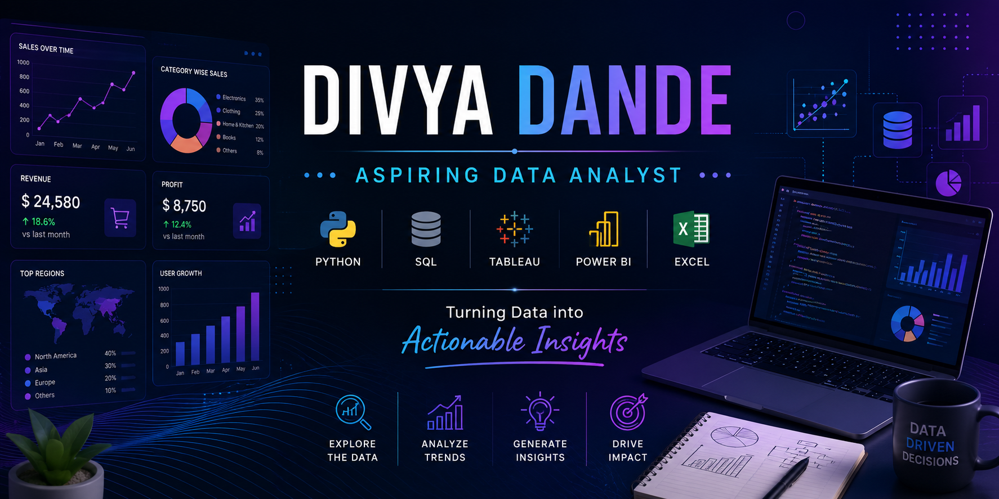

  

<h1 align="center">Hi 👋, I'm Divya Dande</h1>

<h3 align="center">
Data Analyst | Python | SQL | Power BI | Tableau | Excel
</h3>

  Turning raw data into meaningful insights 📊

---

## 👩‍💻 About Me

- 🎯 Data Analyst with a Software Engineering background and 2.4+ years of professional experience.
- 📊 Hands-on experience with Python, SQL, Pandas, NumPy, Power BI, Tableau, Excel, and Exploratory Data Analysis.
- 🔍 Experienced in analyzing datasets, identifying patterns, creating visualizations, and deriving insights through personal analytics projects.
- 💻 Professional background in Java, Spring Boot, REST APIs, SQL, and MySQL.
- 📁 Building data analytics projects using real-world datasets to strengthen practical analytical skills.
- 📍 Andhra Pradesh, India
- 📫 Mail me: dandedivya1@gmail.com
---

## 🛠️ Tech Stack

### 📊 Data Analytics

  
  
  
  
  
  
  
  
  
  

### 💻 Software Engineering

  
  
  
  
  
  
  
  

---

## 📂 Featured Projects

### 🛒 Amazon Product Sales Analysis

Performed exploratory data analysis on Amazon product sales data to identify purchase patterns, product trends, and factors associated with higher purchase activity using Python, Pandas, and NumPy.

🔗 [View Project](https://github.com/Dandedivya/amazon-product-sales-analysis)

---

### 👥 HR Analytics Dashboard

Developed an interactive HR analytics dashboard using Tableau to analyze employee attrition and workforce trends across departments, job roles, gender, education, age groups, and salary slabs.

🔗 [View Project](https://github.com/Dandedivya/HR-Analytics-Dashboard)

---

### 🥗 Healthy Diet Analysis
Exploratory Data Analysis of nutrition, calorie intake, BMI, and lifestyle patterns using Python.

🔗 [View Project](https://github.com/Dandedivya/Healthy-Diet-Analysis)

---

### 🎬 SQL Queries on IMDb
SQL practice project covering filtering, joins, aggregations, and analysis queries.

🔗 [View Project](https://github.com/Dandedivya/SQL-Queries-on-IMDB)

---

### 🚇 Delhi Metro Network Analysis
Analyzed metro network data using Python and visualization techniques.

🔗 [View Project](https://github.com/Dandedivya/Delhi-Metro-Network-Analysis)

---

### 📈 Stock Market Analysis
Performed stock market data analysis using Python and visualizations.

🔗 [View Project](https://github.com/Dandedivya/Stock-Market-Analysis-using-Python)

---

## 📊 GitHub Stats

  

  

---

## 🔥 GitHub Streak

  

---

## 🌐 Connect With Me

  

---

## ✨ Quote

> “Data is not just numbers. Data tells stories, solves problems, and drives decisions.”
